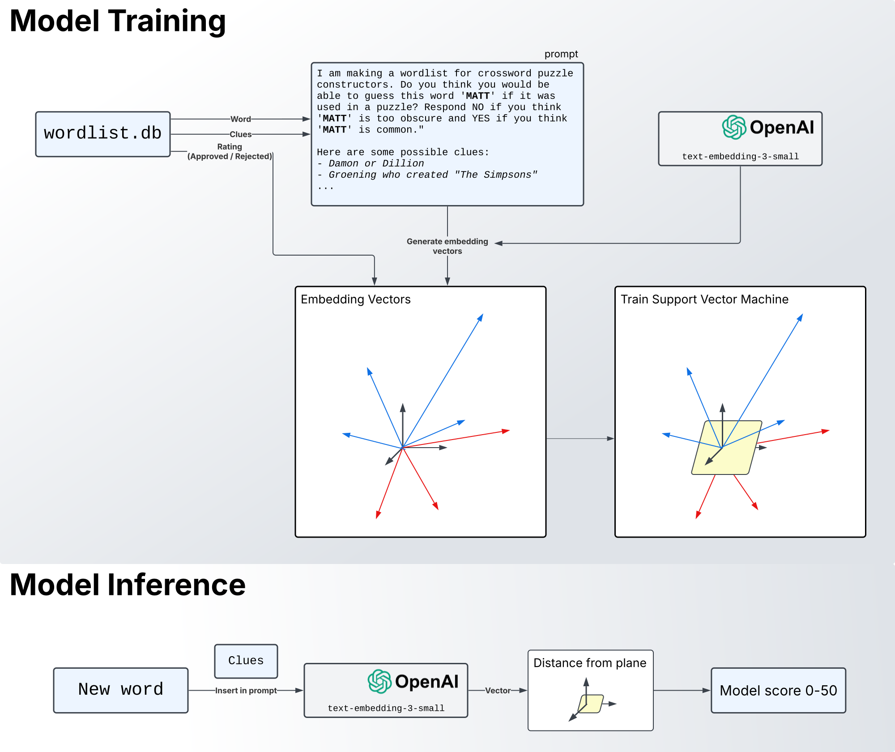
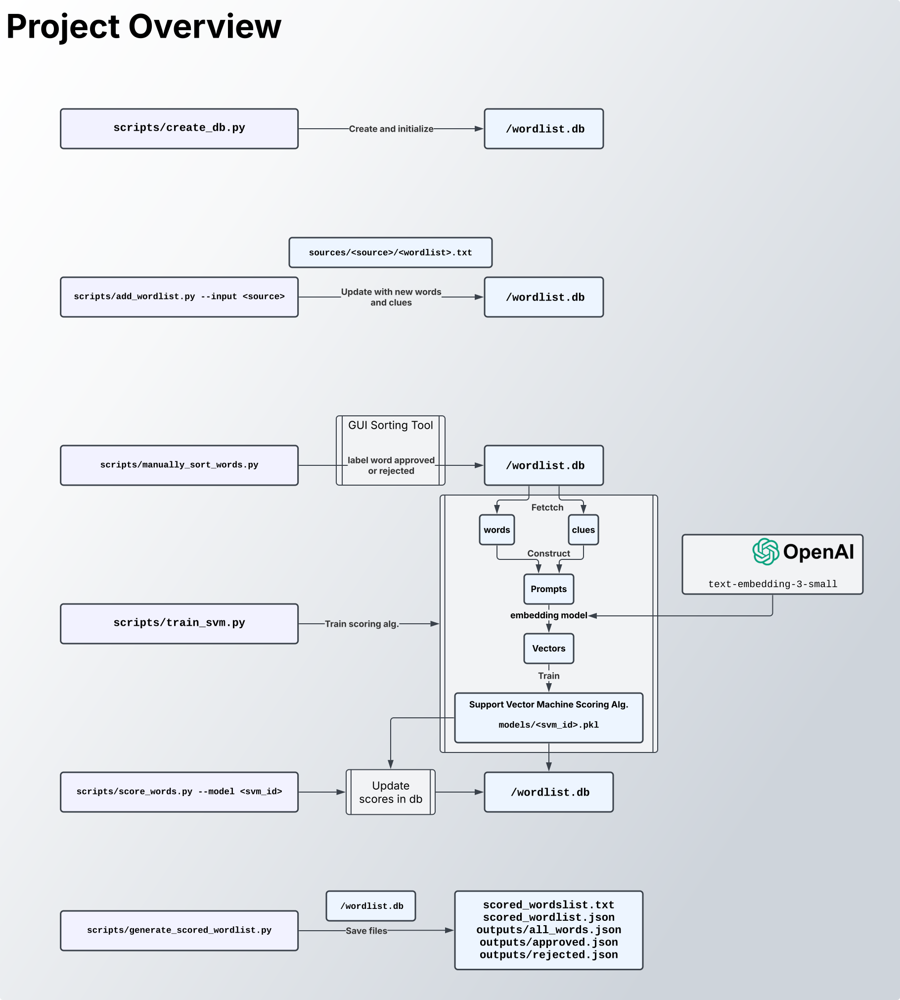

# Wordlist for Puzzle Construction

**[► Download Wordlist (TXT)](https://github.com/mattabate/wordlist/blob/main/matts_wordlist/scored_wordlist.txt)**

**[► Download Wordlist (JSON)](https://github.com/mattabate/wordlist/blob/main/matts_wordlist/scored_wordlist.json)**  

Welcome to my **Puzzle Constructor Wordlist** repository! This project provides a curated collection of words to aid you in creating crossword puzzles and other word-based games. Here you'll find: 

- A free-to-use scored wordlist of ~260,000 words.  
- A set of scripts for training your own scoring model (using examples of words you like and dislike).

A technical description and quickstart guide is provided below.  Email me with questions: mabate13@gmail.com.

## Table of Contents

1. [AI/ML Scoring Algorithm](#1-aiml-scoring-algorithm)
2. [Quickstart](#2-quickstart)
3. [License & Credits](#3-license--credits)

## 1. AI/ML Scoring Algorithm


*Figure 1: Scoring Approach — Words and clues are converted to vectors using an embedding model. An SVM is trained to seperate liked words (vectors) from disliked words (vecotrs), and word scores are generated from this SVM.*

For [my own wordlist](https://github.com/mattabate/wordlist/blob/main/matts_wordlist/scored_wordlist.txt), I started with over 600,000 words, collected from [3 major free-to-use wordlists](#credits). I manually labeled 35,000 words as `approved` or `disliked`, of which 21,000 were used to train the SVM. The final wordlist of 260,000 words was selected by distilling the intiial 600,000 to the words that were either top scoring or had previously been approved.  

## 2. Quickstart

In this quickstart guide, you'll train your own scoring model and create a scored wordlist.


*Figure 1: Project Overview*

### 2.1 Clone and Install Dependencies


Clone the repo and change into the project directory:

```bash
git clone git@github.com:mattabate/wordlist.git
cd wordlist
```

Initialize and install all dependencies with:

```bash
poetry init
poetry install
```

### 2.2 Set Up Environment  

First, copy `.env.template` to `.env` and add your OpenAI API key:

```bash
cp .env.template .env
```

Then, open `.env` and update the following values:

```ini
SQLITE_DB_FILE=wordlist.db
EMB_MODEL=text-embedding-3-small
OPENAI_API_KEY=your-api-key-here
CLUES_SOURCE=wordlist/lib/clues.template.py
```

By default, this project uses OpenAI’s `text-embedding-3-small` model. If you want to include clues in your database, you'll need to configure a clue source.  

Right now, `wordlist/lib/clues.template.py` contains a placeholder function:  

```python
def fetch_clues(word: str) -> str | None:
    """
    Given a word, return a str containing one or more clues for that word.

    Example:
    fetch_clues("Cat") -> "- Mouse catcher\n- Word with house or hobie\n- Certain sailboat, for short"
    """
    return None
```

Since `fetch_clues` returns `None`, no clues will be added to your database or used in training unless you define your own function.  

To add custom clues:  

1. Copy `clues.template.py` to `clues.py`:  

   ```bash
   cp wordlist/lib/clues.template.py wordlist/lib/clues.py
   ```

2. Modify `clues.py` to implement your own `fetch_clues` function.  
3. Update `CLUES_SOURCE` in `.env` to point to `wordlist/lib/clues.py`.  

This lets you integrate custom clues into your training process.


### 2.3 Create the Wordlist Database

Set up the SQLite database by running:

```bash
poetry run python3 scripts/create_db.py
```

This creates a `wordlist.db` file with key tables such as:

- **words** – stores each word, its clues, and status (`approved`, `rejected`, or `unchecked`).
- **sources** – records details about each word source.
- **word_model_score** – logs scores from various models.

### 2.4 Add a New Wordlist Source


To import words from a new wordlist (in Crossword Constructor TXT format) to your database, follow these steps:

1. **Create a Folder**: In the `sources/` directory, create a folder for the wordlist you'd like to incorperate (e.g., `sources/matts_wordlist/`).
2. **Add Files**:  
   - Place your scored wordlist TXT file into this folder.
   - Create a `config.yaml` with:
     ```yaml
     name: "matts_wordlist"
     url: "https://github.com/mattswordlist/wordlist"
     file_path: "sources/matts_wordlist/matts_wordlist.txt"
     ```
3. **Import to Database**:  
   Run the following command to add the words (and their scores) to the database:
   ```bash
   poetry run python3 scripts/add_wordlist --input matts_wordlist
   ```

*Repeat these steps for each additional wordlist source you want to add.*

> **Note:** As a starting example, I've provided my personal wordlist in the `quickstart/matts_wordlist.txt`. For additional resources and wordlists, consider the following:
> - [Chris's Jones Wordlist](https://github.com/christophsjones/crossword-wordlist)
> - [Spread the Word(list)](https://www.spreadthewordlist.com/)
> - [Peter Broda's Wordlist](https://peterbroda.me/crosswords/wordlist/)


To import a scored wordlist (in Crossword Constructor TXT format), follow these steps:

1. **Create a Folder**: In the `sources/` directory, create a folder for your wordlist (e.g., `sources/matts_wordlist/`).
2. **Add Files**:  
   - Place your scored wordlist TXT file into this folder.
   - Create a `config.yaml` with content like:
     ```yaml
     name: "matts_wordlist"
     url: "https://github.com/mattswordlist/wordlist"
     file_path: "sources/matts_wordlist/matts_wordlist.txt"
     ```
3. **Import to Database**:  
   Run the following command to add the words (and their scores) to the database:
   ```bash
   poetry run python3 scripts/add_wordlist --input matts_wordlist
   ```

*Repeat these steps for each additional wordlist source you want to add. (See the Community Wordlists section for recommendations.)*

### 2.5 Manually Sort Words

Refine your wordlist by manually approving or rejecting words. This curated data is essential for training your model.


- **Input File**:  
  The tool uses `inputs/manually_sort_words.json` for its word queue. If the file or `inputs/` directory doesn’t exist, it will be created automatically on the first run.
  
- **Run the Tool**:  
  Launch the sorting interface with:
  ```bash
  poetry run python3 scripts/manually_sort_words.py
  ```
  
- **Interface Features**:  
  The application displays one word (with clues) at a time. You can:
  - **Accept** a word.
  - **Reject** a word.
  - **Pass** if unsure.
  - **Google** the word for more context.
  - **Undo** a rejection if needed.

### 2.6 Train the SVM Model

Once you've sorted your words, train an SVM model using your approved and rejected words. This model will help score the words based on your preferences.

Run the training script with:

```bash
poetry run python3 scripts/train_svm.py
```

The script will:
- Load approved and rejected words from the database.
- Train an SVM model and display its score and training duration.
- Prompt you to save the model as a pickle file in the `models/` directory (with metadata recorded in the database).

### 2.7 Generate Scored Wordlist

After training your model, score the words in your database using:

```bash
poetry run python3 scripts/score_words.py --model <model_id>
```

This command computes scores for your words based on the trained model and saves them to the database. Run this step once per model to generate the final wordlist (in Crossword Constructor format).


### 2.8 Additional Scripts

For every word in the database without clues, try to find clues:
```bash
poetry run python3 scripts/update_clues.py
```

Make a histogram showing the distribution of scores in my wordlist
```bash
poetry run python3 scripts/wordlist_historgram.py --input <scores_json_path>
```

## 3. License & Credits

### License

This project is distributed under a [Creative Commons Attribution-NonCommercial-ShareAlike 4.0 International License](https://creativecommons.org/licenses/by-nc-sa/4.0/). In short, you are free to:

- **Share** — copy and redistribute the material.
- **Adapt** — remix, transform, and build upon the material.

*Under the conditions that you:*

1. **Give Attribution** – Credit the original source.
2. **Use Non-Commercially** – No commercial use allowed.
3. **ShareAlike** – Distribute modifications under the same license.

### Credits

- **Community Wordlists**:  My personal wordlist borrows words from numberous excelent community wordlists, including:
  - [Chris's Jones Wordlist](https://github.com/christophsjones/crossword-wordlist)
  - [Spread the Word(list)](https://www.spreadthewordlist.com/)
  - [Peter Broda's Wordlist](https://peterbroda.me/crosswords/wordlist/)

- **Contributors**:    Thank you to everyone who has contributed suggestions, code, and feedback.
