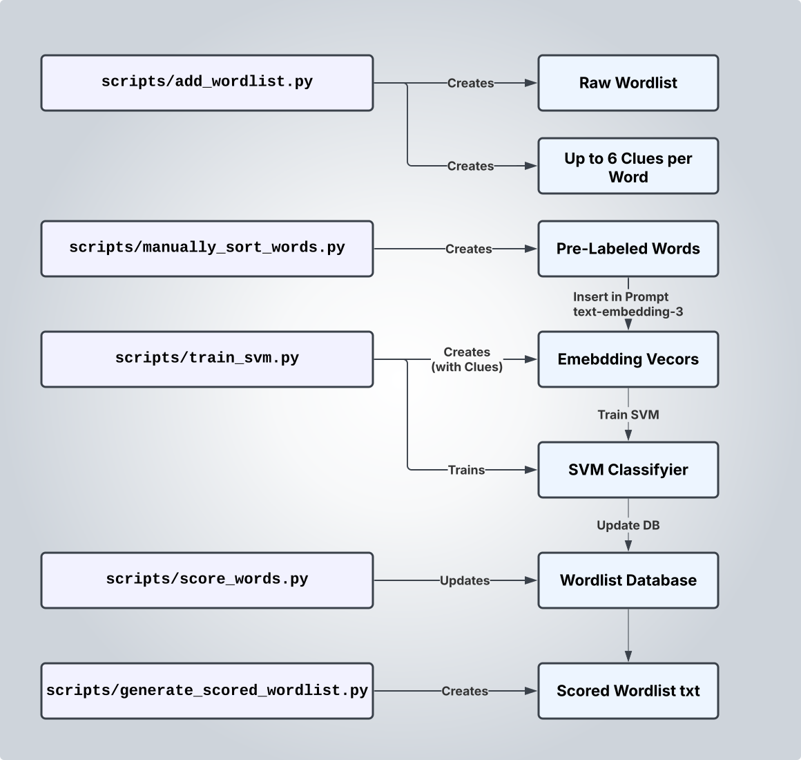
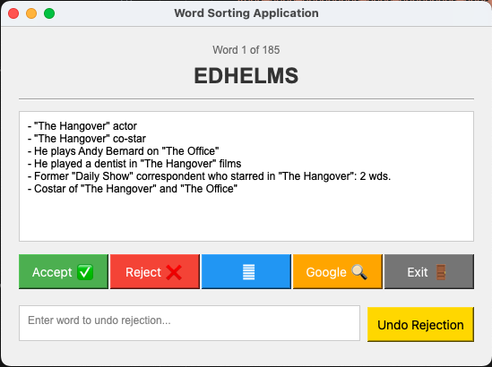

# Wordlist for Puzzle Construction

**[► Download Wordlist (JSON)](https://github.com/mattabate/wordlist/blob/main/matts_wordlist/scored_wordlist.json)**  
**[► Download Wordlist (TXT)](https://github.com/mattabate/wordlist/blob/main/matts_wordlist/scored_wordlist.txt)**

Welcome to the **Puzzle Constructor Wordlist** repository! This project provides a curated collection of words to power your crossword puzzles and other word-based games. Here you'll find: 

- A scored wordlist of ~260,000 words.
- A tool for training your own AI/ML model to score words (using examples of words you like and dislike).

A technical description and quickstart guide is provided below.  Email me with questions: mabate13@gmail.com.


## Table of Contents

1. [Scoring Algorithm Descrition]()
1. [Scripts & Tools](#setup--tools)
1. [Quickstart](#setup--tools)
2. [License & Credits](#license--credits)

## 1. AI/ML Scoring Algorithm

## 1. Setup & Tools



### 1.1 Clone the Repository


Clone the repo and change into the project directory:

```bash
git clone git@github.com:mattabate/wordlist.git
cd wordlist
```

### 1.2 Install Dependencies with Poetry

Initialize and install all dependencies with:

```bash
poetry init
poetry install
```

### 1.3 Create the Database

Set up the SQLite database by running:

```bash
poetry run python3 scripts/create_db.py
```

This creates a `wordlist.db` file with key tables such as:

- **words** – stores each word, its clues, and status (`approved`, `rejected`, or `unchecked`).
- **sources** – records details about each word source.
- **word_model_score** – logs scores from various models.

### 1.4 Add a New Wordlist Source

To import a scored wordlist (in Crossword Constructor TXT format), follow these steps:

1. **Create a Folder**: In the `sources/` directory, create a folder for your wordlist (e.g., `sources/matts_wordlist/`).
2. **Add Files**:  
   - Place your scored wordlist TXT file into this folder.
   - Create a `config.yaml` with content like:
     ```yaml
     name: "matts_wordlist"
     url: "https://github.com/mattswordlist/wordlist"
     file_path: "sources/matts_wordlist/matts_wordlist.txt"
     ```
3. **Import to Database**:  
   Run the following command to add the words (and their scores) to the database:
   ```bash
   poetry run python3 scripts/add_wordlist --input matts_wordlist
   ```

*Repeat these steps for each additional wordlist source you want to add. (See the Community Wordlists section for recommendations.)*

### 1.5 Manually Sort Words

Refine your wordlist by manually approving or rejecting words. This curated data is essential for training your model.



- **Input File**:  
  The tool uses `inputs/manually_sort_words.json` for its word queue. If the file or `inputs/` directory doesn’t exist, it will be created automatically on the first run.
  
- **Run the Tool**:  
  Launch the sorting interface with:
  ```bash
  poetry run python3 scripts/manually_sort_words.py
  ```
  
- **Interface Features**:  
  The application displays one word (with clues) at a time. You can:
  - **Accept** a word.
  - **Reject** a word.
  - **Pass** if unsure.
  - **Google** the word for more context.
  - **Undo** a rejection if needed.

### 1.6 Train the SVM Model

Once you've sorted your words, train an SVM model using your approved and rejected words. This model will help score the words based on your preferences.

Run the training script with:

```bash
poetry run python3 scripts/train_svm.py
```

The script will:
- Load approved and rejected words from the database.
- Train an SVM model and display its score and training duration.
- Prompt you to save the model as a pickle file in the `models/` directory (with metadata recorded in the database).

### 1.7 Generate Scored Wordlist

After training your model, score the words in your database using:

```bash
poetry run python3 scripts/score_words.py --model <model_id>
```

This command computes scores for your words based on the trained model and saves them to the database. Run this step once per model to generate the final wordlist (in Crossword Constructor format).

## 2. License & Credits

### License

This project is distributed under a [Creative Commons Attribution-NonCommercial-ShareAlike 4.0 International License](https://creativecommons.org/licenses/by-nc-sa/4.0/). In short, you are free to:

- **Share** — copy and redistribute the material.
- **Adapt** — remix, transform, and build upon the material.

*Under the conditions that you:*

1. **Give Attribution** – Credit the original source.
2. **Use Non-Commercially** – No commercial use allowed.
3. **ShareAlike** – Distribute modifications under the same license.

### Credits

- **Community Wordlists**:  
  This project builds upon numerous community wordlists, including:
  - [Chris's Jones Wordlist](https://github.com/christophsjones/crossword-wordlist)
  - [Spread the Word(list)](https://www.spreadthewordlist.com/)
  - [Peter Broda's Wordlist](https://peterbroda.me/crosswords/wordlist/)

- **Contributors**:  
  Thank you to everyone who has contributed suggestions, code, and feedback—your efforts help make this project even better!
