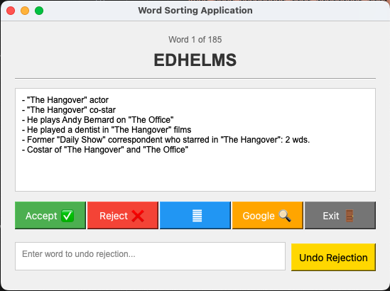

# Wordlist for Puzzle Construction

**[► Download the Wordlist (JSON)](https://github.com/mattabate/wordlist/blob/init/data/matts_wordlist/scored_wordlist.json)**

**[► Download the Wordlist (TXT)](PLACEHOLDER_LINK_TXT)**

Welcome to my **Puzzle Constructor Wordlist** repository! This project provides a curated collection of words to help in creating crossword puzzles or other word-based puzzles. Additionally, it includes scripts and tools for scoring and filtering wordlists according to custom criteria.

## Whats in this Repo?

- A scored wordlist of 120,000 words.
- A pretrained AI/ML model that scores words (based on my preferences).  
- A script for for training your own AI/ML models based on your preferences (you'll need examples of words you do and don't like). 
- A tool for quickly labeling training data, that allows you to see real published clues for the words in your wordlist. 


## Table of Contents
1. [Project Description](#project-description)  
2. [Tools & Scripts](#tools--scripts)  
3. [Usage Instructions](#usage-instructions)  
4. [Required Packages](#required-packages)  
5. [License & Credits](#license--credits)

---

## Project Description

### Initial Wordlist Candidate Set 

I formed an initial wordlist from various online wordlists, including but not limited to:
- [**Chris Jones Wordlist**](https://github.com/christophsjones/crossword-wordlist)
- [**Spread the Word(list)**](https://www.spreadthewordlist.com/)

A main problem was that these souces contained words and phrases that I would otherwise choose not to use. These bad-answers  were difficult to indentify efficiently and remove since the intial wordlist contained ~130K words.

### Labeling Words to Match my Preferences

I then built a tool for manually approving or rejecting words (from a final wordlist). The tool allows one to google the phrase and look at common clues from [**Crossword Tracker**](https://crosswordtracker.com/).



Using this tool, I sorted approximately ~35K words by hand:
- about ~24K were manually marked as approved words that I would be happy to put in a crossword puzzle, and
- about ~10K were removed from the wordlist entirely. These rejected words are now only stored in
**[this file](https://github.com/mattabate/wordlist/blob/main/data/raw/rejected.json)**.

_Note: This process took 10s of hours. While this effort greatly improved the list, unfamiliar or undesirable words still appear regularly._


### Training a Model on my Preferences 
After manual curation, an AI/ML model was trained to predict whether a new word would be acceptable. This is done in the following way:
- A training and test set were formed from the 35K labeled words, where every word (e.g., `"HOUSE"`) was put into a longer prompt (e.g., `"ANSWER: HOUSE"`).
- These prompts were then passed through an embedding model (transformer) to form a ≈1500 dimentional vector for each intial word. 
- Finally, a Support Vector Machine (SVM) was trained on the output of the embedding model. This SVM is stored as a pickle file in the repo and facilitates the on the fly scoring of new words. 

_Note: The script for training the SVM itself and the manual sorting tool are not yet included in this repository._

---

## Tools & Scripts

Currently, the main script included is for **scoring** words via the pretrained SVM:

- **`scripts/generate_scored_wordlist.py`**  
  Generates a scored wordlist in the `/wordlist` directory based on the SVM predictions.

Future plans (not yet included in this repo) involve:
- The **manual sorting tool** with integrated clue display and online search.
- The **SVM training script** to retrain or update the model with additional data.

For reference, see [the script on GitHub (placeholder)](PLACEHOLDER_LINK_SCRIPT) if you’d like to track its development progress.

---

## Usage Instructions

To score words using the existing model:

1. **Obtain an OpenAI API key**:  
   - Copy `.env.template` to a new file called `.env`.
   - Insert your OpenAI API key in the `OPENAI_API_KEY` field.
2. **Install required dependencies** (see [Required Packages](#required-packages)).
3. **Run the script** to generate a new scored wordlist:
   ```bash
   cd wordlist
   python3 scripts/generate_scored_wordlist.py
